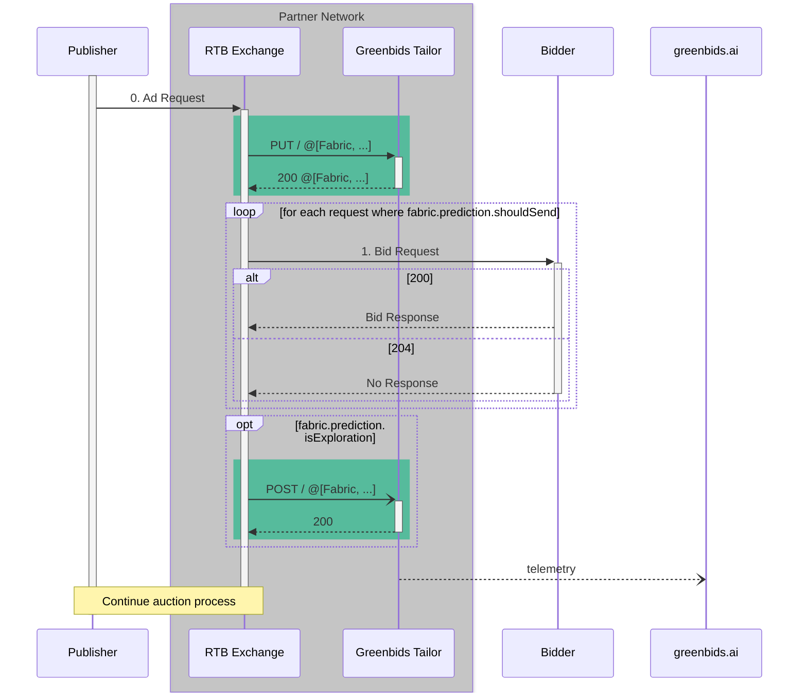

# 🪡 Greenbids Tailor

Bring **traffic shaping** to your own cloud!

[](https://www.greenbids.ai)

[](http://www.gnu.org/licenses/agpl-3.0)

## 🍱 Integration

### Sequence Diagram

Following the interaction diagram provided by the [OpenRTB API Specification (version 2.5) (§2)](https://www.iab.com/wp-content/uploads/2016/03/OpenRTB-API-Specification-Version-2-5-FINAL.pdf) here is an example of where the Greenbids Tailor product must be called.



### Example

Here is a Python-like pseudocode example of integration.

```python
def handleAdRequest(adRequest):
  # Call the Greenbids Tailor PUT endpoint to filter the list of possible bidders
  # This is a local call (localhost or local network) to ensure low latency
  fabrics = requests.put("http://tailor:8000", json=[
    {
      "featureMap": {
        "bidder": bidder.name,
        "device": adRequest.get("device", "unknown"),
        "userId": adRequest.get("user_id", "unknown"),
        "secretIngredient": "our own secret ingredient",
        "greatAnswer": 42,
      }
    }
    for bidder in BIDDER_LIST
  ]).json()

  # Do your regular calls here to send a bid requests to the selected bidders
  for fabric in fabrics:
    if not fabric["prediction"]["shouldSend"]:
        # Skip any bidder that as too few response probability
        continue

    # Create a bid request and send it to the bidder
    rsp = requests.post(bidder.url, json={...})

    # Store the outcome in the fabric
    fabric["groundTruth"]["hasResponse"] = (rsp.status_code != 204)

  # Call the Greenbids Tailor POST endpoint for exploration
  if fabrics[0]["prediction"]["isExploration"]:
    # You may use a fire-and-forget mechanism
    requests.post("http://tailor:8000", json=fabrics)

  # Continue the auction process
  ...

```

### Routes

See API documentation [online](https://greenbids.github.io/greenbids-tailor-external/).

## 🚀 Deployment

Depending on your current stack, find the best way to deploy this service.

### 🐍 Executable

```bash
pip install greenbids-tailor
greenbids-tailor
```

We advise you to create a virtual environment to avoid any dependency mismatch on your system.

### 🐳 Docker

```bash
docker run -P -d --name greenbids-tailor ghcr.io/greenbids/tailor:latest
docker port greenbids-tailor
```

### ☸ Helm

```bash
helm upgrade --install --create-namespace --namespace greenbids tailor oci://ghcr.io/greenbids/charts/tailor
```

You have to [authenticate your Kubernetes cluster](https://kubernetes.io/docs/tasks/configure-pod-container/pull-image-private-registry/) against [GitHub container registry](https://docs.github.com/en/packages/working-with-a-github-packages-registry/working-with-the-container-registry#authenticating-with-a-personal-access-token-classic), and pass the name of the secret through `--set 'imagePullSecrets[0].name=<your-secret-name>'`.
