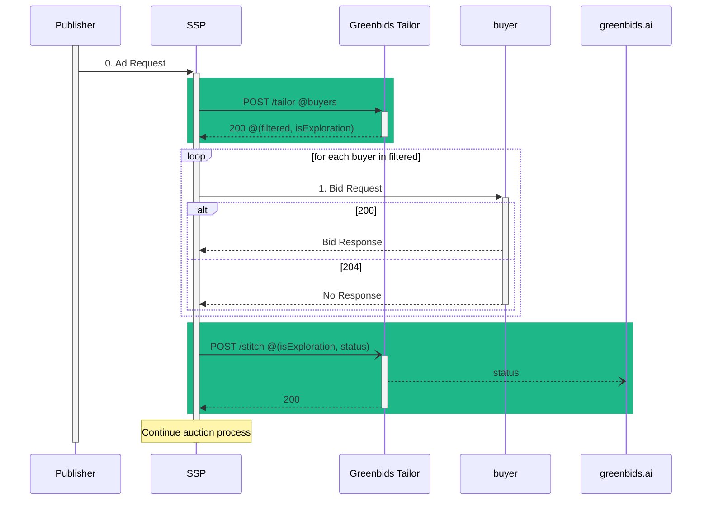

# 🪡 Greenbids Tailor

Traffic shaping for SSPs

[](https://www.greenbids.ai)

[](http://www.gnu.org/licenses/agpl-3.0)

## 🤖 API Reference

### Interactions

Following the interaction diagram provided by the [OpenRTB API Specification (version 2.5) (§2)](https://www.iab.com/wp-content/uploads/2016/03/OpenRTB-API-Specification-Version-2-5-FINAL.pdf) here is an example of where the Greenbids Tailor product must be called.



### Routes

Below, you can find a detailed description of the routes provided by the Greenbids Tailor API:

* Filter a list of given demand side partners
    ```http
    POST /tailor
    ```
    * **Parameters**:
        * TBD

* Report actual partners behavior
    ```http
    POST /stitch
    ```
    * **Parameters**:
        * TBD

* Readiness/Health check of the service
    ```http
    GET /health
    ```

## 🚀 Deployment


Depending on your current stack, find the best way to deploy this service.

* Executable
  ```bash
  pip install greenbids-tailor
  greenbids-tailor --port 8080
  ```

* Docker
  ```bash
  docker run -P ghcr.io/greenbids/tailor:latest
  ```

* Helm
  ```bash
  helm install --create-namespace --namespace greenbids tailor oci://ghcr.io/greenbids/tailor
  ```
