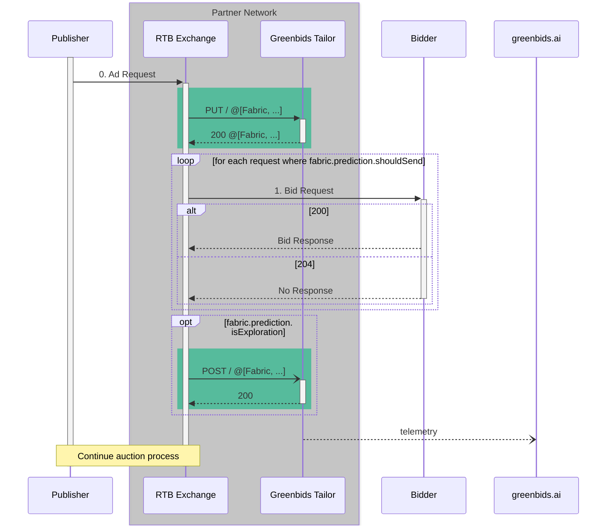

# 🪡 Greenbids Tailor

Bring **traffic shaping** to your own cloud!

[](https://www.greenbids.ai)

[](http://www.gnu.org/licenses/agpl-3.0)

## 🚀 Deployment

### 📥 Install and run

Depending on your current stack, find the best way to deploy this service.

#### 🐍 Executable

```bash
pip install greenbids-tailor
greenbids-tailor
```

We advise you to create a virtual environment to avoid any dependency mismatch on your system.

#### 🐳 Docker

```bash
docker run -P -d --name greenbids-tailor ghcr.io/greenbids/tailor:latest
docker port greenbids-tailor
```

#### ☸ Helm

```bash
helm upgrade --install --create-namespace --namespace greenbids tailor oci://ghcr.io/greenbids/charts/tailor
```

You have to [authenticate your Kubernetes cluster](https://kubernetes.io/docs/tasks/configure-pod-container/pull-image-private-registry/) against [GitHub container registry](https://docs.github.com/en/packages/working-with-a-github-packages-registry/working-with-the-container-registry#authenticating-with-a-personal-access-token-classic), and pass the name of the secret through `--set 'imagePullSecrets[0].name=<your-secret-name>'`.

### ✅ Test

Supposing that you have successfully launched a running server locally (it's accessible through `localhost:8000`), you may be able to test your deployment.

```bash
# Simple liveness probe
curl http://localhost:8000/healthz/liveness
# Empty throttling request
curl -X PUT --json '[]' http://localhost:8000/
# Empty report request
curl -X POST --json '[]' http://localhost:8000/
```

All these 3 calls may return an HTTP 200 response with a valid JSON payload.
If you want to test more routes, you can check the full [API documentation](https://greenbids.github.io/greenbids-tailor-external/)

## 🍱 Integration

### 🔄 Sequence Diagram

Following the interaction diagram provided by the [OpenRTB API Specification (version 2.5) (§2)](https://www.iab.com/wp-content/uploads/2016/03/OpenRTB-API-Specification-Version-2-5-FINAL.pdf) here is an example of where the Greenbids Tailor product must be called.



### 🏋️ Example

An integration example is provided through the [`locustfiles/root.py`](https://github.com/greenbids/greenbids-tailor-external/blob/main/locustfiles/root.py#L12).
It highlights when the Greenbids Tailor service must be called during the ad request processing.
It also propose an example of features to pass in the payload (only for demonstrative purpose).

[Locust](https://locust.io/) is also a load testing framework. You can try it with the following commands (in a cloned repository):

```bash
# Install the required dependencies
pip install -r locustfiles/requirements.txt
# Start load testing job
locust --headless -f locustfiles --users 10 --spawn-rate 1 -H http://localhost:8000
```

Abort it when you want, pressing `Ctrl+C`.
It will print you a summary of the test:

```text
Type     Name                             # reqs      # fails |    Avg     Min     Max    Med |   req/s  failures/s
--------|-------------------------------|-------|-------------|-------|-------|-------|-------|--------|-----------
POST     /                                  7231     0(0.00%) |      5       1      35      5 |  293.21        0.00
PUT      /                                  7234     0(0.00%) |      5       1      32      5 |  293.33        0.00
GET      /healthz/liveness                     2     0(0.00%) |     12      11      13     12 |    0.08        0.00
GET      /healthz/readiness                    4     0(0.00%) |      8       6      10      8 |    0.16        0.00
GET      /healthz/startup                      4     0(0.00%) |     11       4      21      6 |    0.16        0.00
--------|-------------------------------|-------|-------------|-------|-------|-------|-------|--------|-----------
         Aggregated                        14475     0(0.00%) |      5       1      35      5 |  586.95        0.00
```
