# 🪡 Greenbids Tailor

Bring **traffic shaping** to your own cloud!

[](https://www.greenbids.ai)

[](http://www.gnu.org/licenses/agpl-3.0)

## 🚀 Deployment

### 📥 Install and run

Depending on your current stack, find the best way to deploy this service.

#### 🐍 Executable

```bash
pip install greenbids-tailor
greenbids-tailor
```

We advise you to create a virtual environment to avoid any dependency mismatch on your system.

#### 🐳 Docker

```bash
docker run -P -d --name greenbids-tailor ghcr.io/greenbids/tailor:latest
docker port greenbids-tailor
```

#### ☸ Helm

```bash
helm upgrade --install --create-namespace --namespace greenbids tailor oci://ghcr.io/greenbids/charts/tailor
```

### ✅ Test

Supposing that you have successfully launched a running server locally (it's accessible through `localhost:8000`), you may be able to test your deployment.

```bash
# Connectivity check
curl http://localhost:8000/ping
# Simple liveness probe
curl http://localhost:8000/healthz/liveness
# Empty throttling request
curl -X PUT --json '[]' http://localhost:8000/
# Empty report request
curl -X POST --json '[]' http://localhost:8000/
```

All these 3 calls may return an HTTP 200 response with a valid JSON payload.
If you want to test more routes, you can check the full [API documentation](https://greenbids.github.io/greenbids-tailor-external/)

### 🔧 Configuration

Some environment variables may be used to change the default configuration of the service according to your needs:

| Variable                         | Description                                                                           | Default                                |
|----------------------------------|---------------------------------------------------------------------------------------|----------------------------------------|
| GREENBIDS_TAILOR_API_USER        | **Required** User name used to authenticate to backend                                |                                        |
| GREENBIDS_TAILOR_API_KEY         | Key used to authenticate to backend. Required to download dedicated model.            |                                        |
| GREENBIDS_TAILOR_LOG_LEVEL       | Log level of the Greenbids Tailor service                                             | INFO                                   |
| WEB_CONCURRENCY                  | How many worker processes to launch                                                   | 1, 4 in Docker, 1 in the Helm chart    |
| OTEL_EXPORTER_PROMETHEUS_ENABLED | Enable the Prometheus exporter to expose service metrics (set to any value to enable) |                                        |
| OTEL_EXPORTER_PROMETHEUS_PORT    | Port on which to expose Prometheus metrics                                            | 9464                                   |
| OTEL_TRACES_SAMPLER              | Telemetry traces sampling strategy                                                    | parentbased_traceidratio in containers |
| OTEL_TRACES_SAMPLER_ARG          | Telemetry traces sampling                                                             | 1, 0.0001 in containers                |

## 🍱 Integration

### 🔄 Sequence Diagram

Following the interaction diagram provided by the [OpenRTB API Specification (version 2.5) (§2)](https://www.iab.com/wp-content/uploads/2016/03/OpenRTB-API-Specification-Version-2-5-FINAL.pdf) here is an example of where the Greenbids Tailor product must be called.

```mermaid
sequenceDiagram
    participant Publisher
    box rgba(128, 128, 128, 0.33) Partner Network
        participant SSP
        participant GB as Greenbids Tailor
    end
    box rgba(255, 255, 255, 0.3) Internet Egress
        participant Bidder1
        participant Bidder2
        participant greenbids.ai
    end

    critical Start up
        activate GB
        GB ->> greenbids.ai: Fetch model
        greenbids.ai -->> GB: compiled model
        deactivate GB
    end

    activate Publisher
    Publisher ->>+ SSP: 0. Ad Request

    rect rgba(30, 183, 136, 0.66)
    SSP ->>+ GB: PUT /<br/>[Bidder1: ❔, Bidder2: ❔, ...]
    GB -->>- SSP: 200 OK<br/>[Bidder1: ✅, Bidder2: ❌, ...]
    end


    SSP ->>+ Bidder1 : 1. Bid Request
    note right of SSP: The filtered bid request<br/>to Bidder2 is not sent
    Bidder1 -->>- SSP: 204 NO RESPONSE

    opt if prediction.isTraining
        rect rgba(30, 183, 136, 0.66)
            SSP -)+ GB: POST /<br/>[Bidder1: ❌, ...]
            GB ->>+ GB: update model
            deactivate GB
            GB -->>- SSP: 204 No Response
        end
    end

    note over Publisher,SSP: Continue auction process
    deactivate SSP
    deactivate Publisher
    par Background report
        GB --) greenbids.ai: telemetry
    end
```



### 🏋️ Example

An integration example is provided through [`python/src/greenbids/tailor/load_testing/rtb.py`](https://github.com/greenbids/greenbids-tailor-external/blob/main/python/src/greenbids/tailor/load_testing/rtb.py#L38).
It highlights when the Greenbids Tailor service must be called during the ad request processing.
It also propose an example of features to pass in the payload (only for demonstrative purpose).

[Locust](https://locust.io/) is also a load testing framework. You can try it with the following commands (in a cloned repository):

```bash
# Install the required dependencies
pip install './python[load-testing]'
# Start load testing job
locust --headless -f ./python/src/greenbids/tailor/load_testing --processes -1 --users 17 --spawn-rate 4 -H http://localhost:8000
```

Abort it when you want, pressing `Ctrl+C`.
It will print you a summary of the test.
The following has been obtained on a Google Cloud Compute Engine instance of type `e2-highcpu-8` runnning the docker image with `WEB_CONCURRENCY` set to 7:

```text
Type     Name                          # reqs      # fails |    Avg     Min     Max    Med |   req/s  failures/s
--------|----------------------------|-------|-------------|-------|-------|-------|-------|--------|-----------
POST                                     5010     0(0.00%) |      3       1      92      3 |   12.30        0.00
PUT                                    507116     0(0.00%) |      3       1     128      3 | 1245.16        0.00
GET      /healthz/liveness                 12     0(0.00%) |      5       3       8      4 |    0.03        0.00
GET      /healthz/readiness                13     0(0.00%) |      4       3       5      4 |    0.03        0.00
GET      /healthz/startup                   8     0(0.00%) |      4       3       5      4 |    0.02        0.00
--------|----------------------------|-------|-------------|-------|-------|-------|-------|--------|-----------
         Aggregated                    512159     0(0.00%) |      3       1     128      3 | 1257.55        0.00

Response time percentiles (approximated)
Type     Name                                  50%    66%    75%    80%    90%    95%    98%    99%  99.9% 99.99%   100% # reqs
--------|--------------------------------|--------|------|------|------|------|------|------|------|------|------|------|------
POST                                             3      3      4      4      5      5      6     12     26     92     92   5010
PUT                                              3      3      4      4      5      5      6      7     13     57    130 507116
GET      /healthz/liveness                       4      4      7      7      8      9      9      9      9      9      9     12
GET      /healthz/readiness                      4      4      4      4      5      5      5      5      5      5      5     13
GET      /healthz/startup                        4      4      5      5      5      5      5      5      5      5      5      8
--------|--------------------------------|--------|------|------|------|------|------|------|------|------|------|------|------
         Aggregated                              3      3      4      4      5      5      6      7     14     57    130 512159
```

In addition to these metrics, the server load average barely reach 2.0 while the CPU usage is maintained below 30% with a memory footprint around 2GiB (with a peak on startup at 2.5GiB).
