# 🪡 Greenbids Tailor

Bring **traffic shaping** to your own cloud!

[](https://www.greenbids.ai)

[](http://www.gnu.org/licenses/agpl-3.0)

## 🚀 Deployment

### 📥 Install and run

Depending on your current stack, find the best way to deploy this service.

#### 🐍 Executable

```bash
pip install greenbids-tailor
greenbids-tailor
```

We advise you to create a virtual environment to avoid any dependency mismatch on your system.

#### 🐳 Docker

```bash
docker run -P -d --name greenbids-tailor ghcr.io/greenbids/tailor:latest
docker port greenbids-tailor
```

#### ☸ Helm

```bash
helm upgrade --install --create-namespace --namespace greenbids tailor oci://ghcr.io/greenbids/charts/tailor
```

### ✅ Test

Supposing that you have successfully launched a running server locally (it's accessible through `localhost:8000`), you may be able to test your deployment.

```bash
# Connectivity check
curl http://loculhost:8000/ping
# Simple liveness probe
curl http://localhost:8000/healthz/liveness
# Empty throttling request
curl -X PUT --json '[]' http://localhost:8000/
# Empty report request
curl -X POST --json '[]' http://localhost:8000/
```

All these 3 calls may return an HTTP 200 response with a valid JSON payload.
If you want to test more routes, you can check the full [API documentation](https://greenbids.github.io/greenbids-tailor-external/)

## 🍱 Integration

### 🔄 Sequence Diagram

Following the interaction diagram provided by the [OpenRTB API Specification (version 2.5) (§2)](https://www.iab.com/wp-content/uploads/2016/03/OpenRTB-API-Specification-Version-2-5-FINAL.pdf) here is an example of where the Greenbids Tailor product must be called.

```mermaid
sequenceDiagram
    participant Publisher
    box rgba(128, 128, 128, 0.33) Partner Network
        participant SSP as RTB Exchange
        participant GB as Greenbids Tailor
    end
    participant Bidder
    participant greenbids.ai

    activate GB
    GB ->> greenbids.ai: Fetch model
    greenbids.ai -->> GB: 
    deactivate GB

    loop For every ad request
        activate Publisher
        Publisher ->>+ SSP: 0. Ad Request

        rect rgba(30, 183, 136, 0.66)
        SSP ->>+ GB: PUT /
        GB -->>- SSP: 200 OK
        end

        loop for each fabric
            opt if fabric.prediction.shouldSend
                SSP ->>+ Bidder : 1. Bid Request
                alt 200
                Bidder -->> SSP: Bid Response
                else 204
                Bidder -->>- SSP: No Response
                end
            end
        end

        opt if fabric.prediction. isExploration
            rect rgba(30, 183, 136, 0.66)
                SSP -)+ GB: POST /
                GB -->>- SSP: 204 No Response
            end
        end

        note over Publisher,SSP: Continue auction process
        deactivate SSP
        deactivate Publisher
    end
        GB --) greenbids.ai: telemetry
```



### 🏋️ Example

An integration example is provided through the [`locustfiles/rtb.py`](https://github.com/greenbids/greenbids-tailor-external/blob/main/locustfiles/rtb.py#L8).
It highlights when the Greenbids Tailor service must be called during the ad request processing.
It also propose an example of features to pass in the payload (only for demonstrative purpose).

[Locust](https://locust.io/) is also a load testing framework. You can try it with the following commands (in a cloned repository):

```bash
# Install the required dependencies
pip install -r locustfiles/requirements.txt
# Start load testing job
locust --headless -f locustfiles --processes -1 --users 17 --spawn-rate 4 -H http://localhost:8000
```

Abort it when you want, pressing `Ctrl+C`.
It will print you a summary of the test.
The following has been obtained on a laptop (AMD Ryzen 7 PRO, 16GB RAM) running the Python executable:

```text
Type     Name                  # reqs      # fails |    Avg     Min     Max    Med |   req/s  failures/s
--------|--------------------|-------|-------------|-------|-------|-------|-------|--------|-----------
POST                            16991     0(0.00%) |      4       0     125      5 |  386.06        0.00
PUT                             84973     0(0.00%) |      4       0     125      4 | 1930.70        0.00
GET      /healthz/liveness          1     0(0.00%) |     13      13      13     13 |    0.02        0.00
GET      /healthz/readiness         2     0(0.00%) |      9       7      10      7 |    0.05        0.00
GET      /healthz/startup           1     0(0.00%) |      9       9       9      9 |    0.02        0.00
--------|--------------------|-------|-------------|-------|-------|-------|-------|--------|-----------
         Aggregated            101968     0(0.00%) |      4       0     125      4 | 2316.85        0.00

Response time percentiles (approximated)
Type     Name                      50%    66%    75%    80%    90%    95%    98%    99%  99.9% 99.99%   100% # reqs
--------|--------------------|--------|------|------|------|------|------|------|------|------|------|------|------
POST                                 5      5      6      6      6      7      7      8      9    120    130  16991
PUT                                  4      5      5      5      6      6      7      7      9     99    130  84973
GET      /healthz/liveness          13     13     13     13     13     13     13     13     13     13     13      1
GET      /healthz/readiness         11     11     11     11     11     11     11     11     11     11     11      2
GET      /healthz/startup            9      9      9      9      9      9      9      9      9      9      9      1
--------|--------------------|--------|------|------|------|------|------|------|------|------|------|------|------
         Aggregated                  4      5      5      5      6      6      7      7      9     99    130 101968
```
